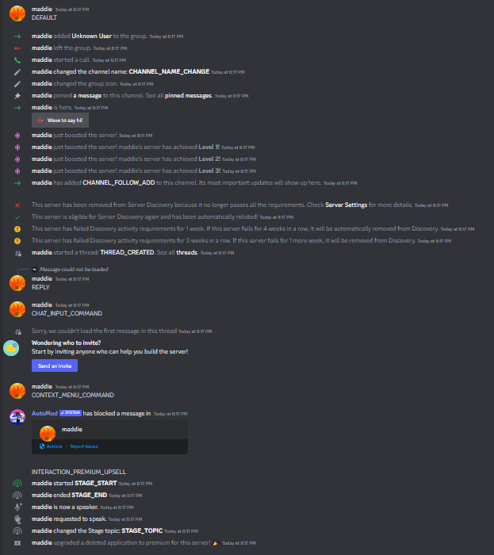
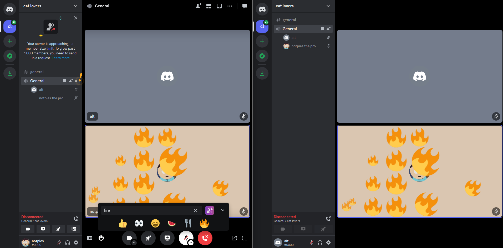
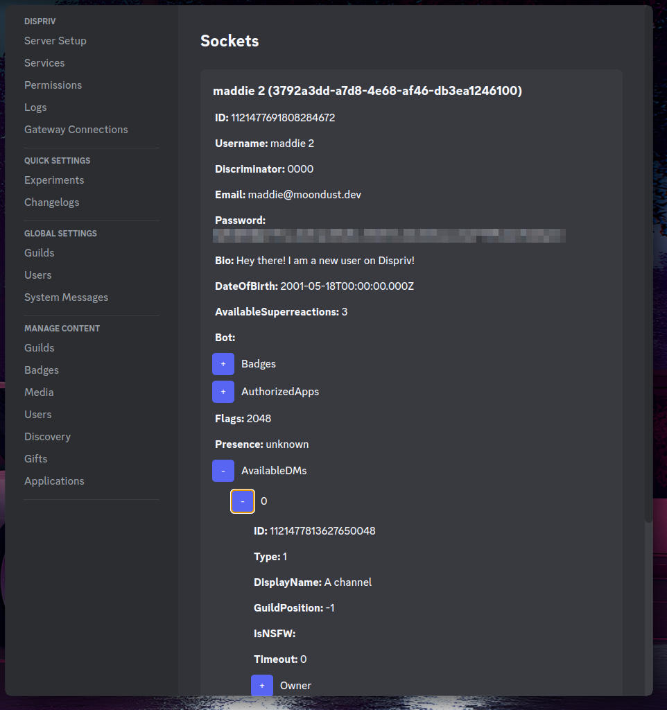

# Dispriv

Dispriv is a private Discord server implementation — a backend built to mimic Discord's own server/API behavior.

## Status

This project is old and deprecated. It is no longer maintained and should not be used as a reference for how to build something like this today. Please do not treat the code as a quality benchmark — a lot of it was written quickly, some of it is messy, and there are known bad security practices throughout (weak auth handling, insufficient input validation, and other shortcuts that should not be replicated in anything meant for real use).

This project was built purely for fun and for educational purposes. It was not designed with production use, security, or long-term maintenance in mind.

## Authors

- Back
- McMistrzYT
- notpies
- nullptr

## Structure

The frontend can be used in one of two ways:

- Using Discord's own real, hosted frontend directly, redirected to Dispriv's backend via an included Fiddler script.
- Using a cloned version of Discord's frontend, based on [discord-frontend-cloner](https://github.com/not-nullptr/discord-frontend-cloner).

In addition to the backend and frontend, we also built a custom Electron app that acted as an admin/control panel for the server. It allowed full customization and moderation of the server, including:

- Modifying users
- Moderation actions
- Sending system messages
- General server management

## Screenshots & Recordings

### Screenshots

### Videos

- [Video 1](Docs/1.mp4)
- [Video 2](Docs/2.mp4)

## Notes

- Given the age and state of the code, expect rough edges, incomplete error handling, and inconsistent patterns across the backend, frontend, and Electron app.